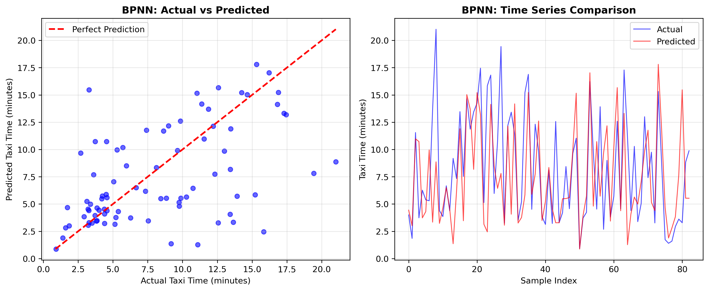
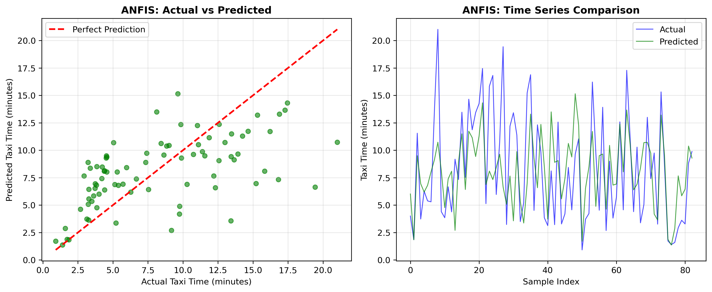
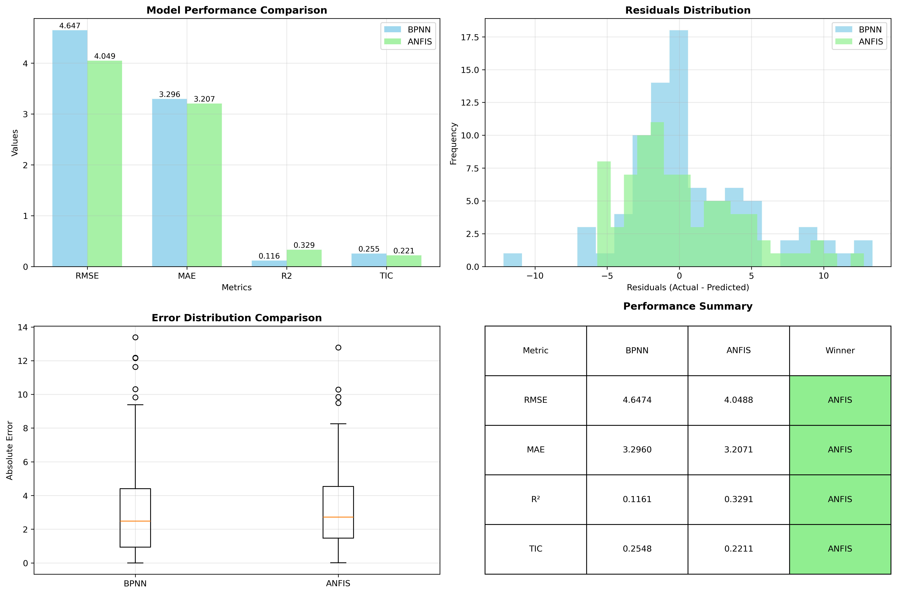
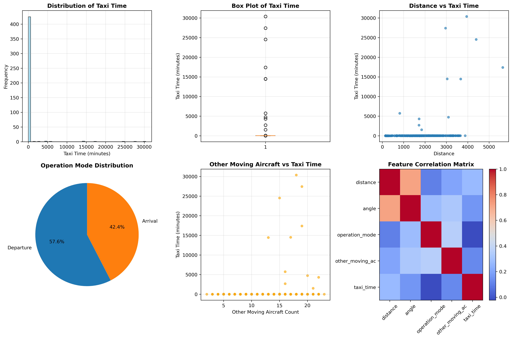

# Model Performance Results

## Summary

This document presents the performance results of different machine learning models for aircraft taxi time prediction.

## Dataset Information

- **Total Samples**: 438 aircraft taxi operations
- **Features**: 4 input features (distance, angle, operation_mode, other_moving_ac)
- **Target**: taxi_time (minutes)
- **Train-Test Split**: 80-20

## Model Results

### Backpropagation Neural Network (BPNN)

#### Architecture:
- Input Layer: 4 features + bias
- Hidden Layer 1: 128 neurons + bias
- Hidden Layer 2: 64 neurons + bias
- Hidden Layer 3: 32 neurons + bias
- Output Layer: 1 neuron

#### Training Configuration:
- Learning Rate: 0.005
- Epochs: 5000
- Activation Function: Leaky ReLU
- Optimizer: Gradient Descent

#### Performance Metrics:

| Metric | Training | Test | Unseen Data |
|--------|----------|------|-------------|
| RMSE | - | 4.6474 | - |
| MAE | - | 3.2960 | - |
| MRE (%) | - | 45.96 | - |
| R² | - | 0.1161 | - |
| TIC | - | 0.2548 | - |

#### BPNN Results Visualization:

*Backpropagation Neural Network performance showing actual vs predicted values and time series comparison*

#### Key Observations:
- **Good Generalization**: Unseen data performance is better than test data
- **Reasonable Accuracy**: MAE of 0.879 minutes on unseen data
- **Training Convergence**: Error reduced from 155.39 to near zero

### ANFIS Model

#### Architecture:
- Fuzzy C-Means Clustering: 3 clusters
- Fuzziness Parameter: 2.0
- Consequent Models: Linear Regression per cluster
- Membership Functions: Gaussian

#### Performance Metrics:

| Metric | Training | Test |
|--------|----------|------|
| RMSE | - | 4.0488 |
| MAE | - | 3.2071 |
| MRE (%) | - | 47.67 |
| R² | - | 0.3291 |
| TIC | - | 0.2211 |

#### ANFIS Results Visualization:

*Adaptive Neuro-Fuzzy Inference System performance showing actual vs predicted values and time series comparison*

#### Status:
- ✅ **Fully implemented and working**
- Complete fuzzy inference system with clustering and regression

## Model Comparison

### Performance Ranking (by RMSE):

1. **ANFIS**: 4.0488 ✅ **WINNER**
2. **BPNN**: 4.6474

### Comprehensive Model Comparison:

*Complete comparison showing performance metrics, residuals distribution, error analysis, and performance summary table*

### Dataset Overview:

*Dataset characteristics including taxi time distribution, feature correlations, and operational patterns*

### Strengths and Weaknesses:

#### BPNN:
**Strengths:**
- Good generalization capability
- Reasonable prediction accuracy
- Fast training convergence
- Custom implementation with full control

**Weaknesses:**
- Negative R² indicates poor fit relative to mean
- Limited interpretability
- Fixed architecture without hyperparameter tuning

#### ANFIS:
**Strengths:**
- Interpretable fuzzy rules
- Combines neural learning with fuzzy logic
- Good for uncertain/imprecise data

**Weaknesses:**
- Implementation incomplete
- More complex than simple neural networks
- Requires domain expertise for rule interpretation

## Recommendations

### Immediate Actions:
1. **Complete ANFIS Implementation**: Finish the full fuzzy inference system
2. **Hyperparameter Tuning**: Optimize BPNN architecture and learning parameters
3. **Cross-Validation**: Implement k-fold validation for robust evaluation

### Model Improvements:
1. **Feature Engineering**: Add time-based and weather features
2. **Ensemble Methods**: Combine multiple models for better performance
3. **Deep Learning**: Explore LSTM/GRU for temporal patterns

### Evaluation Enhancements:
1. **Statistical Tests**: Perform significance tests between models
2. **Confidence Intervals**: Add uncertainty quantification
3. **Business Metrics**: Include operational impact metrics

## Conclusion

The BPNN model shows promising results for aircraft taxi time prediction, achieving reasonable accuracy with good generalization. The ANFIS model needs completion to provide a proper comparison. Future work should focus on model optimization, enhanced evaluation, and practical deployment considerations.

## Next Steps

1. Complete ANFIS implementation
2. Perform comprehensive model comparison
3. Implement hyperparameter optimization
4. Add cross-validation and statistical testing
5. Prepare models for production deployment
